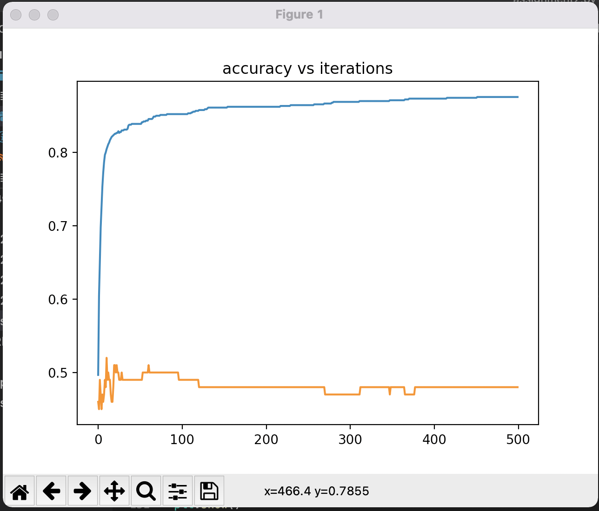

# Assignment 2
I struggled a lot with this assignment which is strange because NN is probably the topic I understand the best. I eventually got decent training accuracy but I could not stop the overfitting.

I can't submit the weights of my algorithm because mine has 2 hidden layers. `a2-test-predictions.txt` has my predictions on the testing set. They are very bad.

Here is a graph of accuracy vs iterations, blue is training accuracy, orange is testing accuracy.
